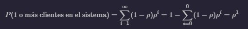
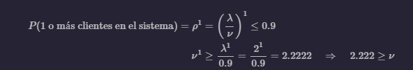

# Tema5

Para la solución de este problema fue necesario entender que lo que se buscaba era P(1 o más clientes en el sistema), por lo cuál se debía utilizar la ecuación:

Una vez obtenida esto:

Una vez obtenido ese resultado se modifica el código para obtener los resultados.

Para las modificaciones se utilizó para probar un factor de nu de 2.21, para obtener resultados positivos, además de esto se cambio P para 1 visto que se desea tener al menos 1 persona en el sistema.

Por último, se compara el valor de fracción contra 0.9 para comprobar si se cumplen las especificaciones de que este sea mayor o igual al 90% y así afichar el mensaje correspondiente.

